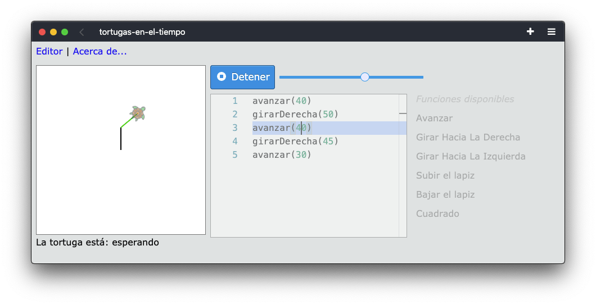

# Tortugas en el tiempo

[](https://travis-ci.org/hugoruscitti/tortugas-en-el-tiempo)

Un entorno de programación experimental.

https://hugoruscitti.github.io/tortugas-en-el-tiempo/




## Cómo iniciar el proyecto

Para iniciar el servidor en modo desarrollo
hay que ejecutar estos comandos:

```
make iniciar
make ejecutar
```

## Cómo ejecutar test

Hay dos tipos de test en el proyecto, así que para ejecutarlos
hay dos comandos diferentes:

```
make test_unidad
make test_e2e
```
